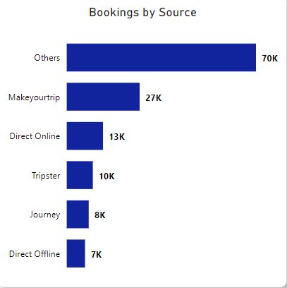

# Hospitality-Revenue-Analysis

A larger version of the dashboard can be viewed [here](https://github.com/Justin-Data/Hospitality-Revenue-Analysis-PowerBI/blob/main/Hotel%20Dashboard%20Picture.png), while the interactive version can be accessed through the file 'Hotel Revenue Analysis File.pbix'.

# Project Overview
For this project, the objective was to analyse the customer data of a hotel company and provide insights to assist in increasing their performance in the hospitality industry.

Tasks:
- Explore key metrics related to the hospitality industry
- Develop a dashboard showcasing the performance of the company
- Provide insights and potential suggestions to increase revenue

Steps taken:

- Assessed the data and utilized Power Query to clean the data accordingly
- Made use of DAX to create measures surrounding key metrics in the hospitality industry
- Conducted EDA to identify potential insights
- Visualised data to convey performance of the company over 3 months worth of data

# Findings

Out of the total number of bookings, just 15% were booked directly. This could be an issue as indirect bookings, such as through online travel agencies, charge commission which will ultimately reduce the total revenue for the hotel company.

- As such, emphasizing direct bookings could lead to increased revenue for the company, which could be achieved by providing an incentive for customers to book directly and marketing the hotel website acccordingly.

Furthermore, the hotel company appeared to suffer from many booking cancellations with a total of around 33k. The issue here can be emphasized when calculating the total missed revenue as a result of such cancellations, which adds up to around £298M. (Revenue_generated - Revenue_realized)

- To tackle this, the company could adjust their policies surrounding cancellations in regards to deposits, refunds and cancellation fees to reduce revenue loss. However, it is important to note that this could lead to less bookings for the hotel company.

Other findings:

- Hotel Exotica in Newcastle generated the most revenue with around £212M
- Newcastle also saw the most revenue with £669M which makes up 39% of their total revenue
- The average rating was 3.62 with hotels in London seeing the highest average score of 3.78
- Hotel Seasons in Newcastle had the lowest average rating of 2.29
- Hotel Blu has the highest occupancy rate with 62%
- Hotel Grands in Leeds has the lowest occupancy rate with 44%
- The room class 'Elite' had the most bookings with around 49k and genereated the most revenue with around £560M
- Hotel Seasons in Newcastle had the highest Average Daily Rate (ADR) with around £16.6k
- The month of May recorded the highest revenue over the 3 months with around £581M
